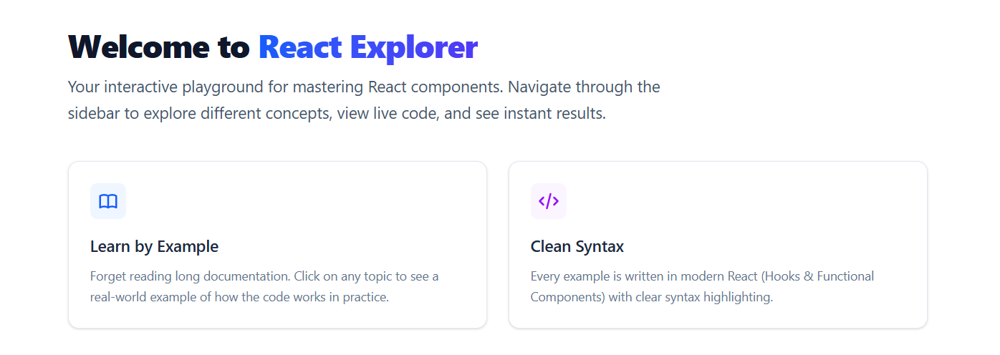
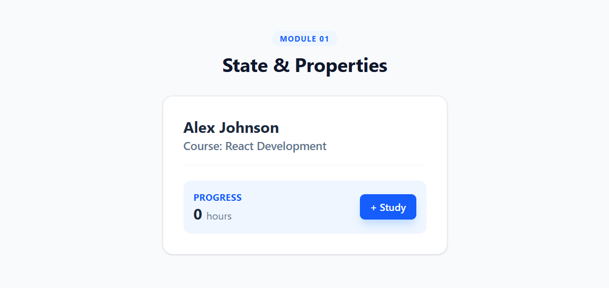
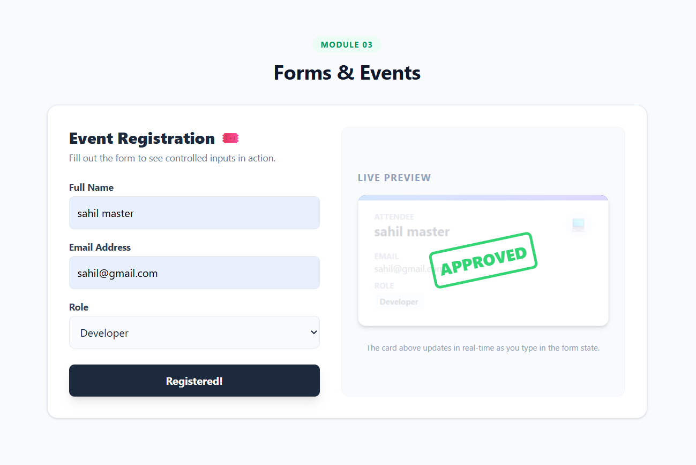
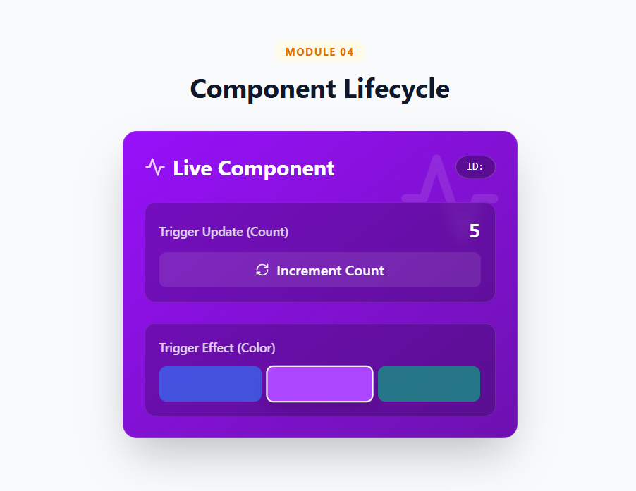
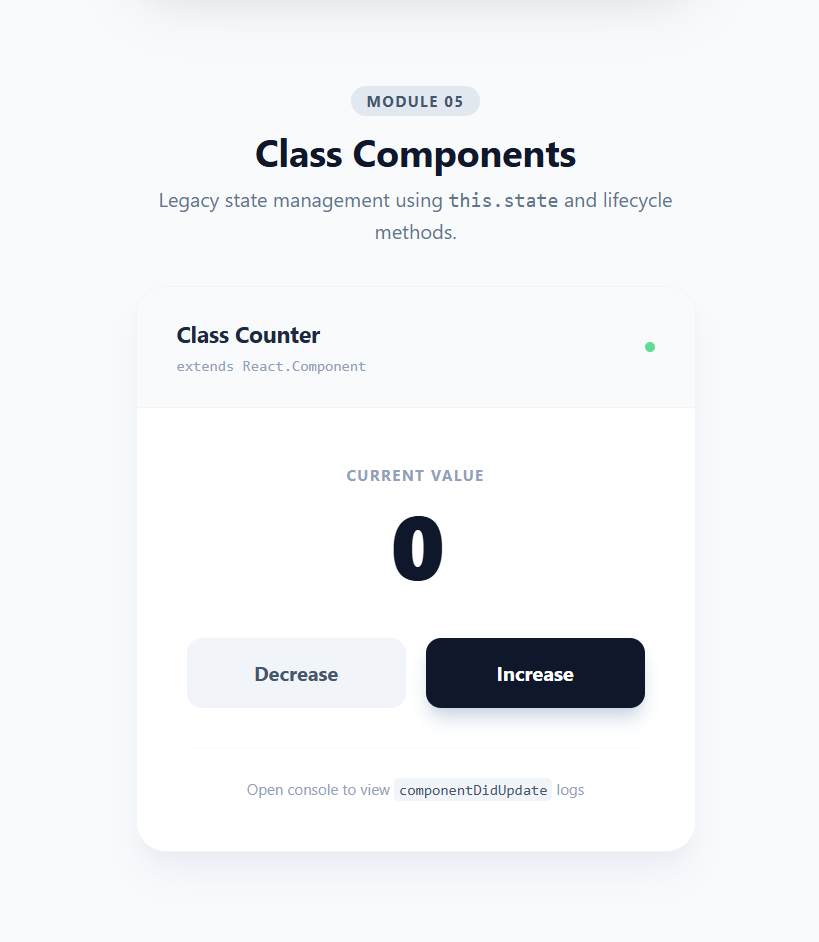
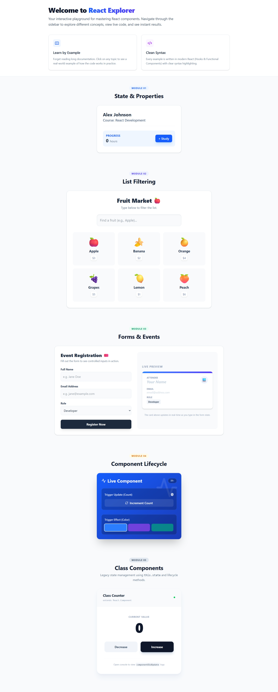

# ⚛️ React Explorer

React Explorer is an **interactive React component playground** designed to visualize and understand core React concepts. From basic JSX to advanced Lifecycle methods — this project acts as practical documentation for modern web development techniques.

---

## 📖 Table of Contents

- ✨ Introduction
- 🧩 Modules & Features
  - Module 1: State & Properties
  - Module 2: List Rendering & Filtering
  - Module 3: Forms & Events
  - Module 4: Component Lifecycle
  - Module 5: Class Components
- 🚀 Getting Started
- 📸 Full Project Preview
- 👨‍💻 Author

---

## ✨ Introduction

React Explorer has a clean and modern UI built with **Tailwind CSS**, using a **modular architecture** where each concept is isolated into its own component for clarity.

> _This makes it a perfect learning resource for beginners and a quick reference guide for developers._

📌 Featured Component: `Intro.jsx`  
📌 Demonstrates: Static functional components, JSX structure, and responsive layouts.

<!-- Add screenshot of Introduction section here -->

---

## 🧩 Modules & Features

### 1️⃣ State & Properties

Component: `StudentProfile.jsx`

📌 Key Concepts

- Passing data using **Props**
- Local state management using **useState**
- Unidirectional data flow
- Simple counter for "Study Hours"

<!-- Add screenshot of this component here -->

---

### 2️⃣ List Rendering & Filtering

Component: `FruitMarket.jsx`

📌 Key Concepts

- Rendering arrays using `.map()`
- **Search filter** using `.filter()`
- Conditional UI — "No results found"

<!-- Add screenshot of this component here -->

---

### 3️⃣ Forms & Events

Component: `EventRegistration.jsx`

📌 Key Concepts

- Controlled form inputs
- Handling user events (`onChange`, `onSubmit`)
- Live preview card updates in real-time

<!-- Add screenshot of this component here -->

---

### 4️⃣ Component Lifecycle

Component: `LifecycleSubject.jsx`

📌 Key Concepts

- useEffect with `[]` → Component Mount
- useEffect with `[deps]` → Component Update
- Cleanup function → Component Unmount
- 📌 Console logs lifecycle changes

<!-- Add screenshot of this component here -->

---

### 5️⃣ Class Components

Component: `ClassCounter.jsx`

📌 Key Concepts

- `this.state` & `this.setState()`
- Lifecycle methods:
  - `componentDidMount`
  - `componentDidUpdate`
  - `componentWillUnmount`
- Event handler binding in classes

<!-- Add screenshot of this component here -->

---


# Start development server
npm run dev

🔗 Open your browser at → http://localhost:5173
```

## 📸 Full Project Preview
<!-- Add long screenshot of full app UI here -->



👨‍💻 Author <br>
 Sahil Nerpagar

Built with ❤️ using React + Tailwind CSS