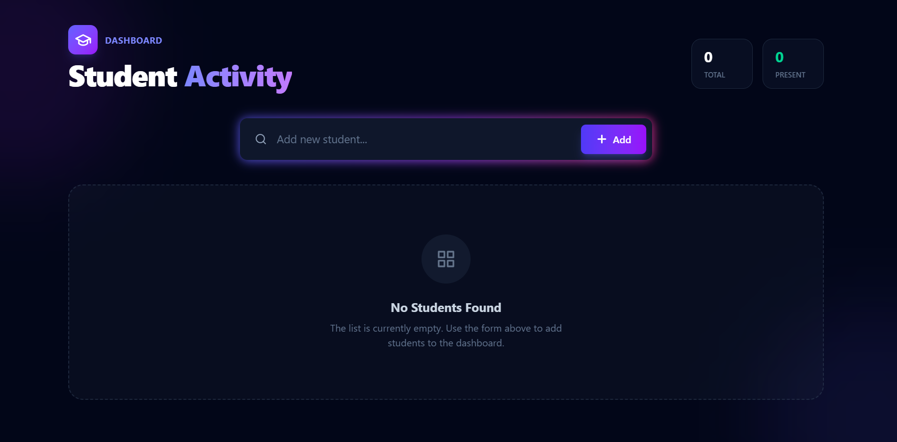
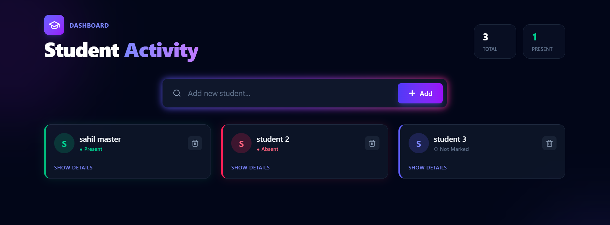

# 🎓 Student Activity Manager

A modern, React-based dashboard for managing student attendance and activity. This project demonstrates key React concepts including **State Management, Refs, Event Handling, and Conditional Rendering** — all wrapped in a premium **Glassmorphism UI** built with Tailwind CSS.

---

## 🚀 Features

* **Interactive Dashboard**

  * Real-time statistics showing total students & attendance count
* **Student Management**

  * Add new students with auto input focus
  * Delete student records instantly
* **Attendance Tracking**

  * Mark students as Present / Absent
  * Dynamic visual feedback with color & glow effects
* **Toggle Details**

  * Expand or collapse student cards to show controls
* **Modern UI/UX**

  * Glassmorphism (frosted glass + backdrop blur)
  * Smooth hover & press animations
  * Responsive grid for all devices

---

## 🛠️ Tech Stack

| Technology             | Usage                                           |
| ---------------------- | ----------------------------------------------- |
| **React**              | Components, Hooks (useState, useEffect, useRef) |
| **Tailwind CSS**       | Design & UI effects                             |
| **Vite** (Recommended) | Fast dev build tool                             |

---

## 🧩 React Concepts Covered

* `useState` — Manage student list & attendance states
* `useRef` — Maintain focus on input fields
* **Conditional Rendering**

  * Show/hide details
  * "No Students Found" message
  * Styling based on attendance state
* **Event Handling** with arguments
* **List Rendering** using `.map()`

---

## 📂 Project Structure

```
EVENTS/
├── public/
├── src/
│   ├── assets/
│   ├── components/
│   │   ├── StudentCard.jsx
│   │   ├── StudentForm.jsx
│   │   └── StudentList.jsx
│   ├── App.css
│   ├── App.jsx
│   ├── index.css
│   └── main.jsx
├── .gitignore
├── eslint.config.js
├── index.html
├── package-lock.json
├── package.json
├── README.md
└── vite.config.js
```

---

## 📸 Screenshots

Here are suggested places to insert your screenshots:

1️⃣ **Empty State (No students)**




2️⃣ **Toggle OFF (collapsed card)**




3️⃣ **Toggle ON (expanded details)**


---

## 🏃‍♂️ How to Run

```bash
# Install dependencies
npm install

# Run development server
npm run dev
```

Then open the server URL shown in the terminal
(Usually **[http://localhost:5173](http://localhost:5173)**)

---

## 🎨 UI Customization

Tailwind custom highlights:

* `backdrop-blur-md` for frosted glass
* `shadow-[0_0_20px_...]` for glow effects
* `bg-slate-800/40` translucent card backgrounds
* `bg-slate-950` dark background theme

You can tweak colors and shadows easily in component classes.

---

## 🧑‍💻 Purpose

> Created for React learning purposes — improves UI skills while mastering core React concepts.

If you like this project, feel free to ⭐ star and enhance further! 😄

---

### 👨‍🏫 Made with Passion for Learning & Innovation 💡