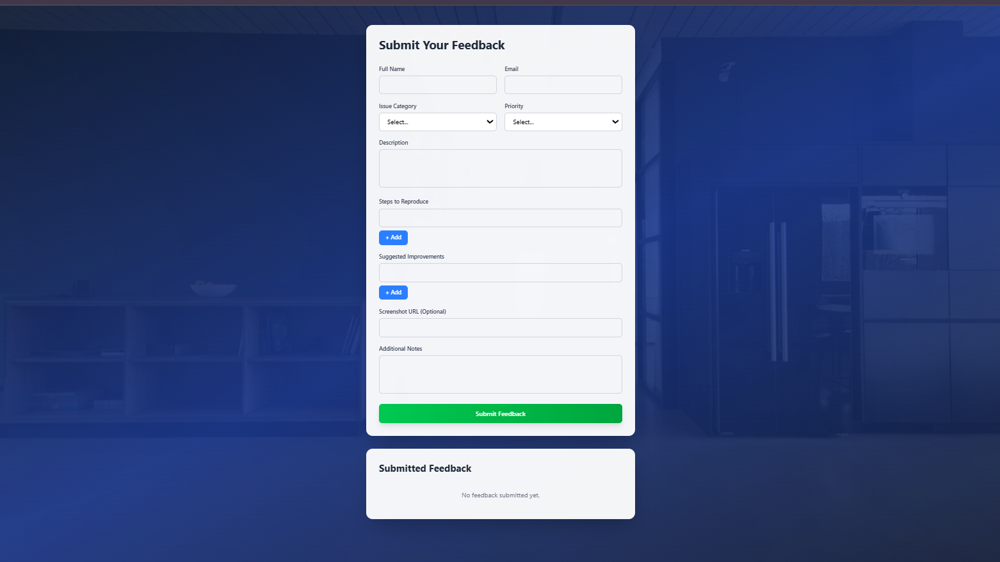

📌  Customer Feedback Form – React Application

A modern, responsive, and dynamic Feedback Submission Form built using React + Tailwind CSS.
This app allows users to submit detailed feedback including issue type, priority, reproduction steps, suggested improvements, screenshots, and additional notes.

Submitted feedback is displayed instantly in a clean UI layout.

🚀 Features
✅ Dynamic Form Fields

Add / Remove Steps to Reproduce

Add / Remove Suggested Improvements

✅ User-Friendly Interface

Gradient background

Blurred glass card design

Fully responsive

Smooth hover and focus transitions

✅ Feedback Submission

Stores submitted feedback in state

Displays all previous feedback in a clean, card-style layout

✅ Form Validation

Required fields: Full Name, Email, Issue Category, Priority, Description

🛠️ Tech Stack
Technology	Purpose
React JS	Component-based UI development
Tailwind CSS	Utility-first styling
JavaScript (ES6+)	App logic & state management
React Hooks	useState for state handling

📂 Project Structure
src/
└── components/
    └── FeedbackForm.js
public/
└── index.html
README.md
package.json

📥 Installation & Setup

1️⃣ Clone the repository
git clone https://github.com/your-username/feedback-form-react.git

2️⃣ Navigate to the project folder
cd feedback-form-react

3️⃣ Install dependencies
npm install

4️⃣ Start the development server
npm start

🧩 How It Works
➤ State Management

The form uses a single state object:

const [formData, setFormData] = useState({
  fullName: '',
  email: '',
  issueCategory: '',
  priority: '',
  description: '',
  stepsToReproduce: [''],
  suggestedImprovements: [''],
  screenshotUrl: '',
  additionalNotes: ''
});

➤ Dynamic Array Fields

Add/remove fields like this:

addField('stepsToReproduce')
removeField(index, 'suggestedImprovements')

➤ Submitting Feedback

All feedback is pushed into:

const [submittedFeedback, setSubmittedFeedback] = useState([]);

🎨 UI Preview (Description)

Clean gradient background

Glass-effect form container

Separate "Submitted Feedback" section

Color tags for category & priority

Fully mobile responsive

✅ output 

📜 License

This project is open-source and free to use.

📌 Auther

Sahil Nerpagar